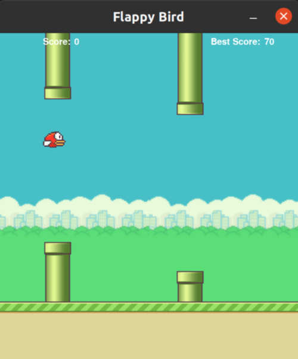

# Clown_of_Flappy_Bird_Game
## About The Game
Flappy Bird is a basic bird game made using [python](https://www.python.org/). The game is that the we have to move the bird from start point without hitting the obstacles. We used pipes as the obstacles and used 3 pictures of the bird to create the animation. 

## Libraries Used
 Python <br />
 Pygame

## Execution
+ After installing the above libraries, Execute the main.py file using below command in the directory folder
```
python main.py
```

## Information
The bird generally falls down due to gravity, we have to use 'space' or 'mouse' to move the bird upward.

* The Home screen contains just contains a stationary bird. we have to press either 'space' or use 'mouse' to start the game.


* we have to move through the pipes in this game like shown in the below screenshot.

 

* As your score is increasing the difficulty will increase.


* If we hit the obstacle, the game ends and we get the screen with restart button and our score. To restart we have to use 'space' and after restart your best score gets updated.


